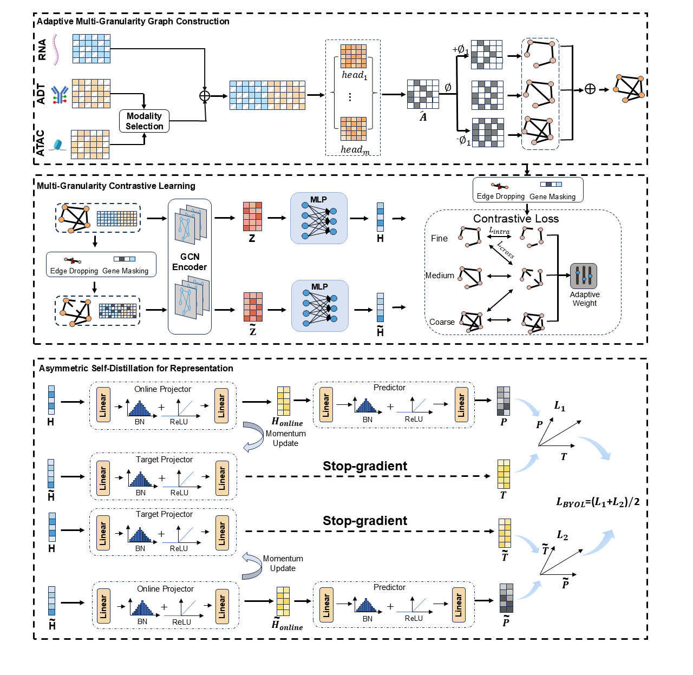

Markdown
# scMAGCL: Multi-Granularity Asymmetric Graph Contrastive Learning for Single-Cell and Cross-Omics Representation



## Introduction

Official PyTorch implementation of **scMAGCL**, a novel framework designed for multi-granularity asymmetric graph contrastive learning to enhance single-cell and cross-omics representation.

## Requirements

The codebase is implemented in Python 3.8+ and PyTorch. To ensure reproducibility, we recommend setting up the environment using the provided `requirements.txt`:

```bash
git clone https://github.com/Miyao15/scMAGCL.git
cd scMAGCL
pip install -r requirements.txt
Core Dependencies:

torch == 2.4.1

torch-geometric == 2.6.1

scanpy == 1.9.8

anndata == 0.9.2

scikit-learn == 1.3.2

scib == 1.1.5

(For a complete list of dependencies including numerical processing, visualization, and system utilities, please refer to requirements.txt.)

Datasets
The preprocessed datasets used for benchmarking in this study are publicly available for reproducibility:

1. Cross-Omics Dataset (scRNA-seq + ADT)

10Xmalt: Available on Figshare at https://figshare.com/articles/dataset/scMAGCA-datasets/30164773

2. Unimodal scRNA-seq Benchmark Datasets

We utilize standard benchmark datasets (e.g., Young, Zeisel, 10X_PBMC). The preprocessed .h5 files can be accessed via the scMGCA benchmark repository:

Link: https://github.com/Philyzh8/scMGCA/tree/master/dataset

Usage
Please ensure you have configured the environment properly and placed the downloaded datasets into the test_data/ directory before execution. Below are the standard execution commands for different representation learning scenarios.

1. Unimodal scRNA-seq Analysis
For single-modality benchmark datasets (e.g., Young), execute the main training script directly:

Bash
python scMAGCL-main/main.py \
  --data_path "test_data/Young/data.h5" \
  --n_clusters 11 \
  --epochs 200
2. Cross-Omics Integration (RNA + ADT)
For CITE-seq data, the pipeline performs automated modality alignment and joint representation learning:

Bash
python preprocessing/preprocess_adt.py \
  --rna_h5ad "test_data/4_10Xmalt/10Xmalt_rna.h5ad" \
  --adt_h5ad "test_data/4_10Xmalt/10Xmalt_adt.h5ad" \
  --label_csv "test_data/4_10Xmalt/10Xmalt_label.csv" \
  --filter2 2000 \
  --no_clr \
  --no_scale \
  --train \
  --n_clusters 11 \
  --n_runs 1
3. Cross-Omics Integration (RNA + ATAC)
For paired scRNA-seq and scATAC-seq data, use the ATAC preprocessing module. Feature selection (HVGs) is applied independently to both modalities:

Bash
python preprocessing/preprocess_atac.py \
  --atac_h5ad "test_data/20_human_pbmc_3k/human_pbmc_3k_atac.h5ad" \
  --rna_h5ad "test_data/20_human_pbmc_3k/human_pbmc_3k_rna.h5ad" \
  --label_csv "test_data/20_human_pbmc_3k/human_pbmc_3k_label_a.csv" \
  --n_clusters 8 \
  --filter1 \
  --f1 2000 \
  --filter2 \
  --f2 2000 \
  --no_clr \
  --no_scale \
  --n_runs 10
License
This project is licensed under the MIT License - see the LICENSE file for details.